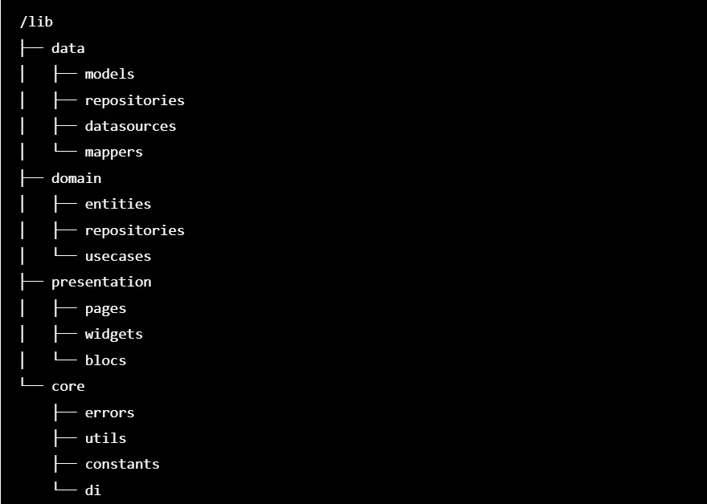
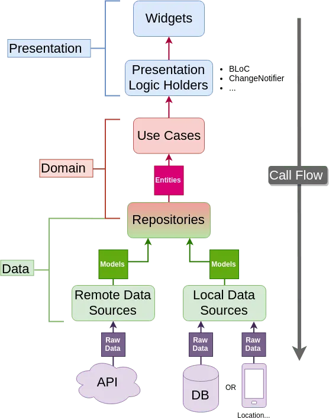

# Gallery Project TDD Clean Code Architecture

**TDD (Test-Driven Development)** — bu **Testga asoslangan dasturlash** metodologiyasidir, unda
dasturchilar kod yozishni boshlashdan oldin testlarni yaratadilar. Bu metodologiya kodning sifatini
oshirish, xatoliklarni erta aniqlash va kodni soddalashtirishga yordam beradi.

### TDD vujudga kelishi:

TDD dastlab **xunit** deb atalgan test framework-lari yordamida 1990-yillarda **Kent Beck**
tomonidan ishlab chiqilgan. Kent Beck, shuningdek, **Extreme Programming (XP)** metodologiyasining
asoschilaridan biri hisoblanadi. TDD metodologiyasi XP ning asosiy prinsiplaridan biri sifatida
paydo bo‘ldi.

### TDD jarayoni:

1. **Test yozish**: Kodni yozishdan avval, bajarilishi kerak bo'lgan funksiyalarni sinovdan
   o‘tkazadigan testlar yoziladi.
2. **Kod yozish**: Testdan muvaffaqiyatli o‘tishi uchun kerakli kod yoziladi.
3. **Testni bajarish**: Yozilgan kod testni muvaffaqiyatli o'tkazishi kerak.
4. **Refaktoring**: Kodingizni tozalash va optimallashtirish uchun refaktoring qilinadi, lekin
   testlar har doim o'tkaziladi.

TDD dasturchilarga yuqori sifatli, o‘qilishi oson va xatoliklardan xoli kod yozish imkoniyatini
beradi.
TDD yana bir ustunligi ko'dlarni pattrinlarga bo'linishi bu ko'dni o'shni osonlashtiradi va sizdan
kegingi dasturchi yoki jamoa bilan ishlagada hechqanday qiyinchliklarsiz loyhani davom etiradi

### Loyha strukturasi (papkalar joylashuvi):

<br>


<br>

Struktura shu ko'rinishda bo'ladi hohishga ko'ra boshaqa papkalar ochish
ham mumkin muhumi ko'd strukturasi buzulmasligi lozim;

### TDD Malumot oqimi:

<br>

<div align="center" style="background-color: #ffffff; padding: 10px; display: inline-block;">
  
</div>

<br>

Yuqaridagi rasmda ko'rishingiz mumkin arxitekturada 3 ta qatlam mavjud:
`**Data**`,`**Domain**` va `**Presentation**`. Har birining o'z maqsadi bor va faqat yuqoridagi
oqimga
ko'ra o'zaro
aloqada bo'lishlari mumkin;
`**Data**` va `**Presentation**` faqat Domain yordamida bir-biri bilan aloqa qilishi mumkin

# ✅ Keling endi men o'z loyhamni tushun tirib o'taman

**Bu loiyhada**-api bilan ishlanmagani uchun bizga `**Remote Data Sources**` mavjud emas
bizga  `**Local Data Sources**`ni o'zi yetarli bo'ladi.
bizda **`Local Data Sources`** bilan ishlash uchun ushbu `abstract class AlbumsLocalDataSource`
mavjud 👇🏻

### **`AlbumsLocalDataSource` nima qiladi?**

- Albomlar va albom ichidagi fayllarni boshqaradi.
- Foydalanuvchi ruxsatlarini tekshiradi va media fayllarga kirishni ta'minlaydi.

---

   ```dart
   import 'package:photo_manager/photo_manager.dart';

/// Rasmlar va albomlarni olish uchun abstrakt class.
/// Bu interfeysni implementatsiya qiluvchi classlar quyidagi funksiyalarni bajarishi kerak:
/// 1. `loadAlbums`: Qurilmadagi mavjud albomlarni yuklash.
/// 2. `loadAlbumsItem`: Berilgan albomning ichidagi media fayllarni yuklash.
abstract interface class AlbumsLocalDataSource {
  /// Qurilmadagi barcha albomlarni yuklaydi.
  /// [Future] qaytaradi, u [List<AssetPathEntity>] ichida albomlar ro'yxatini saqlaydi.
  Future<List<AssetPathEntity>> loadAlbums();

  /// Berilgan albomga tegishli media fayllarni yuklaydi.
  /// [Future] qaytaradi, u [List<AssetEntity>] ichida fayllar ro'yxatini saqlaydi.
  Future<List<AssetEntity>> loadAlbumsItem(AssetPathEntity selectedAlbum);
}
   ```

### **Abstract Class (Interfeys) Nega Kerak?**

Abstract class yozishdan maqsad:

1. **Modullarni ajratish va yanada aniq struktura yaratish:**
    - `AlbumsLocalDataSource` — bu interfeys bo'lib, **faqatgina funksiyalarni e'lon qiladi**. Bu
      esa implementatsiyani (asosiy kodni) boshqacha yozishga imkon beradi.
    - Sizning implementatsiyangiz (`AlbumsLocalDataSourceImpl`) esa interfeysdagi funksiyalarni
      haqiqiy hayotda qanday ishlashini ko'rsatadi.

2. **Moslashuvchanlik (Flexibility):**
    - Agar boshqa turdagi media manager kutubxonasiga (masalan, boshqa kutubxona yoki backend)
      o'tmoqchi bo'lsangiz, faqat yangi implementatsiya yozasiz.
    - Interfeys orqali boshqa qismdagi kodga ta'sir qilmasdan, yangi implementatsiya ishlatiladi.

3. **Kodni o'qilishi va testlanishini osonlashtirish:**
    - Abstract class bilan ishlaganda, ilova logikasi toza va tushunarli bo'ladi. Har bir sinf o'z
      vazifasini bajaradi va bir joyga haddan tashqari ko'p kod yozilmaydi.

4. **Jamoaviy ishlashda yordam:**
    - Jamoangizdagi boshqa dasturchilar sizning abstract classingizdan foydalanib, uning ustiga
      boshqa implementatsiyalar yozishi yoki turli modullarga ulanishi mumkin.

---
Endi bu `abstract class AlbumsLocalDataSource` dan meros olamiz

   ```dart
   // Asosiy implementatsiya class, bu yerda lokal media ma'lumotlarini olish logikasi yozilgan.
class AlbumsLocalDataSourceImpl implements AlbumsLocalDataSource {
  /// Qurilmadagi mavjud albomlarni yuklaydi.
  /// Agar foydalanuvchi media fayllarga ruxsat bergan bo'lsa, albomlar ro'yxatini qaytaradi.
  /// Aks holda, foydalanuvchini sozlamalar sahifasiga yo'naltiradi.
  @override
  Future<List<AssetPathEntity>> loadAlbums() async {
    // Media fayilariga kirish uchin ruxsat so'raymiz.
    var permission = await PhotoManager.requestPermissionExtend();

    // Albomlar ro'yxatini saqlash uchun bo'sh ro'yxat yaratamiz.
    List<AssetPathEntity> albumList = [];

    if (permission.isAuth) {
      // Agar ruxsat berilgan bo'lsa, albomlarni yuklaymiz.
      albumList = await PhotoManager.getAssetPathList(
        type: RequestType.common, // Rasmlar va videolarni yuklaydi.
      );
    } else {
      // Agar ruxsat berilmagan bo'lsa, foydalanuvchini sozlamalar oynasiga "Permission setting" o'tkazamiz.
      PhotoManager.openSetting();
    }

    // Albomlar ro'yxatini qaytaramiz.
    return albumList;
  }

  /// Berilgan albomning ichidagi media fayllarni yuklaydi.
  /// [selectedAlbum] - bu albom linki yani albom joylashgan joyi.
  /// Albom ichidagi barcha fayllarni qaytaradi.
  @override
  Future<List<AssetEntity>> loadAlbumsItem(AssetPathEntity selectedAlbum) async {
    // Albom ichidagi media fayllar sonini aniqlaymiz.
    int assetCount = await selectedAlbum.assetCountAsync;

    // Media fayllarni yuklaymiz (0-dan boshlab to'liq ro'yxatni).
    List<AssetEntity> assetList = await selectedAlbum.getAssetListRange(
      start: 0, // Boshlanish indeksi.
      end: assetCount, // Albomdagi fayllar soni.
    );

    // Media fayllar ro'yxatini qaytaramiz.
    return assetList;
  }
}
   ```

#### **Implementatsiya: `AlbumsLocalDataSourceImpl`**

1. **`loadAlbums()`**:
    - Media fayllarga ruxsat so'raydi (`PhotoManager.requestPermissionExtend`).
    - Ruxsat berilgan taqdirda qurilmadagi barcha albomlarni
      qaytaradi (`PhotoManager.getAssetPathList` yordamida).
    - Agar foydalanuvchi ruxsat bermasa, `PhotoManager.openSetting` orqali ruxsat olish oynasini
      ochadi.

2. **`loadAlbumsItem(AssetPathEntity selectedAlbum)`**:
    - Berilgan albomning ichidagi barcha fayllarni yuklaydi (`selectedAlbum.getAssetListRange`
      yordamida).
    - Bu funksiya faqatgina tanlangan albom ichidagi fayllarni olib keladi.

---

# ✅ Repository haqida

### Repository: Nima uchun kerak?

**Repository** - bu dastur arxitekturasida **ma'lumotlar qatlamini boshqaruvchi
va ma'lumot manbalari (masalan, lokal ma'lumotlar bazasi yoki API) bilan
UI o'rtasida ko'prik bo'lib ishlovchi qatlamdir**. Repository, ma'lumotlar
manbalarini abstraksiyalash orqali kodni modulli va oson boshqariladigan qiladi.

---

1. **Kodning o'qiluvchanligini oshirish:**
    - Ma'lumotlar olish logikasi bir joyda markazlashtiriladi.
    - UI qatlami faqat repository orqali ishlaydi, bu esa kodni osonroq boshqarishga imkon beradi.

2. **Testlashni osonlashtirish:**
    - Repository orqali ma'lumotlarni osonlikcha sinab ko'rish va ularni soxta manbalar bilan
      almashtirish mumkin.
    - Bu **Unit Test** va **Integration Test**larni bajarishni yengillashtiradi.

### Repository Loyihada Qanday Ishlaydi?

1. **Abstraktsiya yaratish:**

- `AlbumsRepository` interfeysini yaratamiz. U qanday funksiyalar kerakligini belgilaydi,
  masalan:
  <br>

  ```dart
  abstract interface class AlbumsRepository {
    Future<Either<Failure, List<AssetPathEntity>>> loadAlbums();
    Future<Either<Failure, List<AssetEntity>>> loadAlbumsItem(AssetPathEntity entity);
  }
  ```

<br>

- Bu UI qatlamiga faqat ma'lumot olish uchun qanday interfeyslar mavjudligini bildiradi.

2. **Implementatsiya:**
    - `AlbumsRepositoryImpl` orqali bu interfeysni amalga oshirasiz. Bu joyda lokal va tarmoq
      manbalaridan ma'lumot olish logikasi yoziladi:
      <br>

   ```dart
   class AlbumsRepositoryImpl implements AlbumsRepository {
     //  AlbumsLocalDataSource konstruktor yordamida chaqiramiz
     final AlbumsLocalDataSource mediaLocalDataSource;
   
     // konstruktor
     AlbumsRepositoryImpl(this.mediaLocalDataSource);
   
     @override
     Future<Either<Failure, List<AssetPathEntity>>> loadAlbums() async {
       try {
   
         final result = await mediaLocalDataSource.loadAlbums();//mediaLocalDataSource chaqiramiz va kelgan ma'lumotni resultga tenglaymiz
         // agar result null bo'lmasa yani bo'sh bo'lsa , biron qiymatga ega bo'lsa shart bajariladi
         if (result.isNotEmpty) {
           // dastur bu qisimga kirsa demak ui kegini etabga malumot success holatda kelganini bildirish uchun
           // Rigth(result) qilib qaytaramiz
           return Right(result);
         } else {
           // Aksholda ma'lumot  error bo'lsa yoki hechqanday ma'lumot bo'lmasa
           // Left() deb error holatni bildiramiz
           return Left(Failure(message: "Image Null"));
         }
       } catch (e) {
         return Left(Failure(message: e.toString())); // ko'zda tutilmagan hatoliklar uchun
       }
     }
   
     // bu finkskiyadaham yuqoridagi funksiya kabi bo'lmoqda
     @override
     Future<Either<Failure, List<AssetEntity>>> loadAlbumsItem(AssetPathEntity entity) async{
       try {
         final result = await mediaLocalDataSource.loadAlbumsItem(entity);
         if (result.isNotEmpty) {
           return Right(result);
         } else {
           return Left(Failure(message: "Album Null"));
         }
       } catch (e) {
         return Left(Failure(message: e.toString()));
       }
     }
   }
   ```

<br>

# ✅ **Use Case haqida tushuncha va vazifasi**

**Use Case (Ish holati)** bu **Clean Architecture**'da asosiy qatlamlardan biri bo'lib,
logik mantiqni (business logic) ajratib olish uchun ishlatiladi.
Use Case **domain layer**da joylashadi.

### 1. **`UseCase` Abstrakt Sinfi:**

<br>

   ```dart
   abstract class UseCase<Type, Params> {
  Future<Either<Failure, Type>> call(Params params);
}
   ```

<br>

- **`UseCase`** abstrakt sinfi umumiy `UseCase` konseptini ifodalaydi, u ma'lum bir **Type** (
  masalan, `List<AssetEntity>`) va **Params** (masalan, `NoParams`) bilan ishlaydi.
- **`call`** metodi, **`Future<Either<Failure, Type>>`** turini qaytaradi, bu metodni asosan
  asinxron ravishda chaqirish kerak.
    - **`Either<Failure, Type>`**: `Either` tipi muvaffaqiyat (`Right`) yoki xatolik (`Left`)
      natijasini qaytaradi. **`Failure`** - bu xatoliklarni ifodalovchi ob'ekt, **`Type`** esa
      muvaffaqiyatli natija turini bildiradi.
- `Params` - bu parametrlar, odatda, `UseCase` ishga tushirilganda kerakli parametrlar bo'ladi. Agar
  parametrlar kerak bo'lmasa, **`NoParams`** ishlatiladi.

---
<br>

### 2. **`MediaAssetsUseCase` Klassining Implementatsiyasi:**

<br>

```dart
class MediaAssetsUseCase implements UseCase<List<AssetEntity>, NoParams> {
  final MediaRepositoryImpl repositoryImpl;

  MediaAssetsUseCase(this.repositoryImpl);

  @override
  Future<Either<Failure, List<AssetEntity>>> call(NoParams params) {
    return repositoryImpl.loadAssets();
  }
}
```

<br>

- **`MediaAssetsUseCase`** - `UseCase` sinfini amalga oshirgan klass. Bu klass `List<AssetEntity>`
  va `NoParams` parametrlarini ishlatadi. Bu shuni anglatadiki, bu `UseCase` rasmlar yoki media
  aktivlarini olish uchun ishlatiladi.
- `repositoryImpl` - bu **`MediaRepositoryImpl`** ob'ekti bo'lib, ma'lumotlarni olish logikasini
  amalga oshiradi. `repositoryImpl` orqali **media resurslarini** (masalan, rasmlar) olish amalga
  oshiriladi.
- **`call` metodi** `NoParams` parametrlarini qabul qiladi va **`repositoryImpl.loadAssets()`**
  metodini chaqiradi. Bu metod, **assets** yoki media fayllarini olish uchun `MediaRepositoryImpl`
  tomonidan ta'minlangan implementatsiyani ishlatadi.
- `repositoryImpl.loadAssets()` ma'lumotlarni olish jarayonini boshqaradi va *
  *`Either<Failure, List<AssetEntity>>`** qaytaradi, ya'ni muvaffaqiyatli yoki xato holatlarni
  bildiruvchi natijani qaytaradi.

---

### 3. **`NoParams` Sinfi:**

Kodda **`NoParams`** sinfi ishlatilgan, lekin u alohida ko'rsatilmagan. Agar u mavjud bo'lsa, bu
sinf **parametrlar bo'lmagan UseCase** uchun ishlatiladi.

Misol:

   ```dart
   class NoParams {}
   ```

**`NoParams`** sinfi `UseCase` uchun **parametrlar bo'lmagan holatni** ifodalaydi. Bu, ko'pincha,
faqat ma'lum bir resursni olish (masalan, barcha albomlar yoki media fayllar) uchun ishlatiladi.

---

### 4. **`Either<Failure, Type>`:**

<br>

Bu konsept **`dartz`** kutubxonasidan olingan. **`Either`** turidan foydalanish, muvaffaqiyat va
xatolikni ajratib ko'rsatish uchun juda qulay.

- **`Left`** - xato holatni ifodalaydi va odatda **`Failure`** bilan bog'liq bo'ladi.
- **`Right`** - muvaffaqiyat holatni ifodalaydi va kerakli ma'lumotni (bu yerda `List<AssetEntity>`)
  qaytaradi.

Shu tariqa, `Either<Failure, Type>` yordamida quyidagi holatlarni aniq ko'rsatish mumkin:

1. **`Right`** - muvaffaqiyatli holat:
    - Misol: agar media fayllari muvaffaqiyatli olingan bo'lsa, `Right(result)` qaytariladi.

2. **`Left`** - xatolik holati:
    - Misol: agar biron bir xato yuz bersa, masalan, ruxsat yo'q bo'
      lsa, `Left(Failure(message: "Error message"))` qaytariladi.

---

### 🎯 **Use Case vazifasi**:

- Ma'lumot olish yoki o'zgartirish jarayonidagi **logik qoidalarni bajaradi**.
- **Repository**dan ma'lumotni oladi.
- **UI yoki boshqa qatlamlar** bilan ishlashda to'g'ridan-to'g'ri Repository'ga murojaat qilishning
  oldini oladi,
  shunda kod **modullashtirilgan** va **o'qilishi oson** bo'ladi.

---

### ✅ **Use Case qanday ishlaydi?**

1. **UI yoki ViewModel** **Use Case**'ni chaqiradi.
2. **Use Case** esa **Repository** bilan bog'lanib, ma'lumotni oladi.
3. Agar ma'lumot muvaffaqiyatli yuklansa, **Right (success)** qiymat qaytaradi.
4. Agar xato bo'lsa, **Left (failure)** qiymat qaytaradi.
   <br>

# Presentation **`Bloc`  `Event`  `State`**

### **Bloc `AlbumsBloc` Klassining Asosiy Strukturası:**

<br>

   ```dart
   class AlbumsBloc extends Bloc<AlbumsEvent, AlbumsState> {
  final AlbumsUseCase albumsUseCase;
  final AlbumsItemUseCase albumsItemUseCase;

  AlbumsBloc({
    required this.albumsItemUseCase,
    required this.albumsUseCase,
  }) : super(AlbumsInitial()) {
    on<GetAlbumsEvent>(_getAlbums);
    on<GetAlbumsItemEvent>(_getAlbumsItem);
  }
}
   ```

<br>

- **`AlbumsBloc`** - Bu Bloc sinfi **AlbumsEvent** voqealarini va **AlbumsState** holatlarini
  boshqaradi.
- **`albumsUseCase`** va **`albumsItemUseCase`** - Bu ikkita usecase `AlbumsBloc` klassida
  yaratilgan va ma'lumotlarni olish uchun ishlatiladi. `albumsUseCase` albumlar ro'yxatini
  olishni, `albumsItemUseCase` esa album ichidagi rasmlar yoki fayllarni olishni boshqaradi.
- **`super(AlbumsInitial())`** - Bloc boshlang'ich holatini belgilaydi. Dastlabki holat *
  *`AlbumsInitial`** bo'ladi.

### **Voqealar Qo'llanilishi:**

<br>

   ```dart
   on<GetAlbumsEvent>(_getAlbums);

on<GetAlbumsItemEvent>(_getAlbumsItem);
   ```

<br>

- **`on<GetAlbumsEvent>(_getAlbums)`**: `GetAlbumsEvent` voqeasi kelganda, `_getAlbums` metodini
  chaqiradi. Bu voqea albumlar ro'yxatini olish uchun ishlatiladi.
- **`on<GetAlbumsItemEvent>(_getAlbumsItem)`**: `GetAlbumsItemEvent` voqeasi
  kelganda, `_getAlbumsItem` metodini chaqiradi. Bu voqea album ichidagi fayllarni olish uchun
  ishlatiladi.

---

### **`_getAlbums` Metodi:**

<br>

   ```dart
   Future<void>? _getAlbums(GetAlbumsEvent event, Emitter<AlbumsState> emit) async {
  try {
    emit(AlbumsLoading()); // Loading holatini yuboradi

    final result = await albumsUseCase.call(NoParams()); // albumsUseCase dan ma'lumot olish
    result.fold((failure) {
      emit(AlbumsError(failure.message)); // Agar xato bo'lsa, error holatini yuboradi
    }, (response) {
      emit(AlbumsSuccess(response)); // Muvaffaqiyatli ma'lumot bo'lsa, success holatini yuboradi
    });
  } catch (e) {
    emit(AlbumsError(
        e.toString())); // Ko'zda tutilmagan xatoliklarni ushlaydi va error holatini yuboradi
  }
}
   ```

<br>

- **`emit(AlbumsLoading())`**: Ma'lumot olish jarayoni boshlanganda **Loading** holatini yuboradi.
- **`albumsUseCase.call(NoParams())`**: `albumsUseCase` yordamida albumlar ro'yxatini olish
  jarayoni. `NoParams` - parametrlar bo'lmagan holat.
- **`result.fold`**: `Either<Failure, Type>` tipi bilan ishlash. Agar **xato** bo'lsa, `AlbumsError`
  holatini yuboradi, aks holda **muvaffaqiyatli ma'lumot** kelganda, `AlbumsSuccess` holatini
  yuboradi.
- **`catch (e)`**: Agar kodda kutilmagan xato yuz bersa, u holda error holati yuboriladi.

---

### **`_getAlbumsItem` Metodi:**

<br>

   ```dart
   Future<void> _getAlbumsItem(GetAlbumsItemEvent event, Emitter<AlbumsState> emit) async {
  try {
    emit(AlbumsLoading()); // Loading holatini yuboradi

    final result = await albumsItemUseCase.call(
        event.selectedAlbum); // AlbumsItemUseCase dan ma'lumot olish
    result.fold((failure) {
      emit(AlbumsError(failure.message)); // Xato holati yuboriladi
    }, (response) {
      emit(AlbumsItemSuccess(response)); // Rasm fayllari muvaffaqiyatli yuklandi
    });
  } catch (e) {
    emit(AlbumsError(
        e.toString())); // Ko'zda tutilmagan xatoliklarni ushlaydi va error holatini yuboradi
  }
}
   ```

<br>

- **`emit(AlbumsLoading())`**: Yana Loading holati yuboriladi, bu yerda albumga tegishli rasm
  fayllari olish jarayoni boshlanadi.
- **`albumsItemUseCase.call(event.selectedAlbum)`**: `albumsItemUseCase` yordamida tanlangan albumga
  tegishli rasm fayllari olinadi.
- **`result.fold`**: Agar xato bo'lsa, **`AlbumsError`** holati yuboriladi, aks holda *
  *`AlbumsItemSuccess`** holati yuboriladi.

---

### **Blocning Holatlari (State):**

- **`AlbumsInitial`**: Dastlabki holat, Bloc hali ishga tushmagan.
- **`AlbumsLoading`**: Ma'lumot olish jarayoni davom etmoqda.
- **`AlbumsError`**: Xatolik yuz berdi.
- **`AlbumsSuccess`**: Muvaffaqiyatli ma'lumot olinmoqda.
- **`AlbumsItemSuccess`**: Album rasmlari muvaffaqiyatli yuklandi.

---

## Event

<br>

### **`AlbumsEvent`** sinfi:

<br>

   ```dart
   abstract class AlbumsEvent extends Equatable {
  const AlbumsEvent();

  @override
  List<Object?> get props => [];
}
   ```

<br>

- **`AlbumsEvent`** sinfi **`Equatable`** sinfidan meros oladi, bu esa Dartda ob'ektlarni
  solishtirishni osonlashtiradi.
- **`Equatable`** yordamida, agar ikkita ob'ektning barcha xususiyatlari bir xil bo'lsa, ular teng
  deb hisoblanadi. Bu holat Bloc arxitekturasida voqealarni (event) va holatlarni (state) oson
  taqqoslash uchun foydalidir.

- **`props`**: `Equatable` sinfi kerakli bo'lgan **props** (xususiyatlar) ro'yxatini belgilaydi.
- **`AlbumsEvent`** sinfi uchun, bu bo'sh ro'yxat (list) qaytariladi, chunki bu sinf o'zi
  xususiyatlarga ega emas. Lekin
- **`GetAlbumsItemEvent`** kabi sinflar o'z xususiyatlarini qo'shishi mumkin.

### **`GetAlbumsEvent`** sinfi:

<br>

   ```dart
   class GetAlbumsEvent extends AlbumsEvent {}
   ```

<br>

- **`GetAlbumsEvent`** — Bu **`AlbumsEvent`** sinfidan meros olgan oddiy sinf. Bu voqea album
  ro'yxatini olish uchun ishlatiladi.
  Uning ichida hech qanday parametr yo'q, ya'ni faqat `GetAlbumsEvent` chaqirilganda album
  ro'yxatini olish jarayoni boshlanadi.

### **`GetAlbumsItemEvent`** sinfi:

<br>

   ```dart
   class GetAlbumsItemEvent extends AlbumsEvent {
  final AssetPathEntity selectedAlbum;

  const GetAlbumsItemEvent(this.selectedAlbum);
}
   ```

<br>

- **`GetAlbumsItemEvent`** — Bu sinf **`AlbumsEvent`** dan meros olgan va **`selectedAlbum`**
  parametriga ega bo'lgan voqea sinfi. Bu voqea albumdan tanlangan rasm yoki faylni olish uchun
  ishlatiladi.
- **`selectedAlbum`** — Bu parametr **`AssetPathEntity`** turidagi ob'ekt bo'lib, tanlangan albumni
  ifodalaydi. **`AssetPathEntity`** `photo_manager` paketidan keladi va albumlar yoki fotosuratlar
  to'plamini boshqarish uchun ishlatiladi.

### **Event nima?**

**Event** — Bu foydalanuvchi yoki tizim tomonidan sodir bo'lgan voqea yoki signalni ifodalaydi. Bloc
arxitekturasida **event** ilovaning holatini o'zgartirishga sabab bo'ladigan harakatni ifodalaydi.
Eventlar asosan quyidagi holatlarda yuzaga keladi:

- **Foydalanuvchi harakati**: Foydalanuvchi ekran elementlarini bossa (masalan, tugma bosilishi),
  ma'lumot yuborishi, o'zgartirishi yoki boshqa harakatlar amalga oshirsa.
- **Tizim tomonidan sodir bo'lgan voqealar**: Masalan, tizim ishga tushganda, serverdan ma'lumot
  olish yoki boshqa tizim voqealari.

**Misollar**:

- **`GetAlbumsEvent`**: Albumlar ro'yxatini olish uchun ishlatiladigan voqea.
- **`GetAlbumsItemEvent`**: Tanlangan albumdagi rasm yoki fayllarni olish uchun ishlatiladigan
  voqea.

Blocda eventlar **UI qatlamidan** keladi va **Bloc** ularni qayta ishlaydi, ya'ni voqealar **Bloc**
ga yuboriladi va Bloc tomonidan kerakli holat (state) yangilanadi.
<br>
### State
---

### **`AlbumsState`** sinfi:

<br>

   ```dart
   abstract class AlbumsState<T> {}
   ```

<br>

- **`AlbumsState`** sinfi **abstrakt** sinf bo'lib, boshqa holatlarni yaratishda umumiy asos
  bo'ladi.
- **`T`** — bu generik parametr, ya'ni bu holatga kiradigan ma'lumot turini belgilash uchun
  ishlatiladi. `T` ma'lum bir holat uchun turli xil qiymatlar (masalan, rasm yoki albomlar ro'yxati)
  bo'lishi mumkin. Shu orqali turli xil ma'lumotlar uchun mos holatlarni yaratish mumkin.

### **`AlbumsInitial`** sinfi:

<br>

   ```dart
   class AlbumsInitial extends AlbumsState {}
   ```

<br>

- **`AlbumsInitial`** — bu dastlabki holat (initial state). Ilova yoki ekranning boshlang'ich holati
  bo'lib, dastur ishga tushganda yoki ma'lumotlar hali yuklanmagan paytda ishlatiladi.
- Bu holat dastur ishga tushishi bilan boshlanadi va uni faqat `Bloc` ni boshlashda ishlatish
  mumkin.

### **`AlbumsLoading`** sinfi:

<br>

   ```dart
   class AlbumsLoading<T> extends AlbumsState {}
   ```

<br>

- **`AlbumsLoading`** — bu holat ma'lumotlar yuklanayotganini bildiradi. Agar serverdan yoki lokal
  ma'lumotlar bazasidan albomlar yoki boshqa ma'lumotlar olinayotgan bo'lsa, bu holat ishlatiladi.
- Foydalanuvchi interfeysida bu holat uchun loading indikatorini (masalan, aylanuvchi yuklash iconi)
  ko'rsatish mumkin.

### **`AlbumsSuccess`** sinfi:

<br>

   ```dart
   class AlbumsSuccess<T> extends AlbumsState {
  final T data;

  AlbumsSuccess(this.data);
}
   ```

<br>

- **`AlbumsSuccess`** — bu holat, agar ma'lumotlar muvaffaqiyatli yuklansa, ishlatiladi. Bu holatda,
  **`T`** ma'lumotlar muvaffaqiyatli qaytarilgan turini bildiradi.
    - **`data`** — bu parametr `T` turidagi ma'lumotni saqlaydi. Masalan, albomlar ro'yxati yoki
      tanlangan albumdagi rasmlar.
- Bu holat UI'da ma'lumotlar muvaffaqiyatli yuklangandan keyin ko'rsatiladigan natijani (masalan,
  albomlar ro'yxatini) bildiradi.

### **`AlbumsItemSuccess`** sinfi:

<br>

   ```dart
   class AlbumsItemSuccess<T> extends AlbumsState {
  final T data;

  AlbumsItemSuccess(this.data);
}
   ```

<br>

- **`AlbumsItemSuccess`** — bu sinf **`AlbumsSuccess`** bilan juda o'xshash, lekin faqat bir
  albumdagi ma'lumotlarni yoki rasm elementlarini muvaffaqiyatli olish uchun ishlatiladi.
- **`data`** — bu yerda ham **`T`** turidagi ma'lumot (masalan, albomdagi rasmlar) saqlanadi.

### **`AlbumsError`** sinfi:

<br>

   ```dart
   class AlbumsError<T> extends AlbumsState {
  final String error;

  AlbumsError(this.error);
}
   ```

<br>

- **`AlbumsError`** — bu holat ma'lumotlarni yuklash yoki boshqa operatsiyalar bajarilishida xato
  yuzaga kelganida ishlatiladi.
    - **`error`** — bu xatolikni ta'riflovchi xabar (string). Bu xatolik foydalanuvchiga
      ko'rsatiladi (masalan, tarmoq xatoliklari yoki server xatoliklari).
- UI'da xatolikni ko'rsatish uchun foydalaniladi (masalan, "Ma'lumotni yuklashda xatolik yuz
  berdi").

### **Tahlil va umumiy tushuncha**:

1. **Generik parametr**: `T` generik parametr sifatida ishlatilgan, bu esa har bir holatni turli
   ma'lumot turlari bilan moslashtirish imkonini beradi.
   Masalan, `AlbumsSuccess<List<AssetPathEntity>>` yoki `AlbumsError<String>`.
2. **Bloc holatlari**: Bu holatlar **Bloc** arxitekturasida ishlatiladi. Har bir holat ilovaning
   turli bosqichlarini ifodalaydi:
    - **`AlbumsInitial`** — dastlabki holat.
    - **`AlbumsLoading`** — ma'lumotlar yuklanayotganda.
    - **`AlbumsSuccess`** va **`AlbumsItemSuccess`** — muvaffaqiyatli holatlar (albomlar va rasmlar
      yuklangan).
    - **`AlbumsError`** — xatolik yuz berganda.

Bu holatlar yordamida ilovadagi har bir turli holatni boshqarish va foydalanuvchiga tegishli
ma'lumotlarni ko'rsatish mumkin.
<br>

# UI

**`BlocBuilder`**:

- `AlbumsBloc`dan holatni olish va UI'ni qayta qurish.
- `GetAlbumsEvent`ni yuborish orqali albomlar ma'lumotlarini yuklash boshlanadi.
<br>

```dart
BlocBuilder<AlbumsBloc, AlbumsState>(bloc: context.read<AlbumsBloc>()..add(GetAlbumsEvent()),
      builder: (context, state) {
        if (state is GalleryInitial) {
          return Center(
            child: Text(
              "Initial",
              style: TextStyle(fontSize: 50, color: Colors.red),
            ),
          );
        }
        // loading holati
        if (state is AlbumsLoading) {
          return Center(
            child: CircularProgressIndicator(),
          );
        }
        // Success holati
        if (state is AlbumsSuccess) {
          // agar state yani holat AlbumsSuccess bo'lsa
          // state.data qilb malumot olinadi bu malumot AlbumsBloc dan keladi
          return CustomSliverAppBar(
              title: "Album",
              child: SliverList(
                delegate: SliverChildBuilderDelegate(
                  childCount: 1,
                        (context, index) {
                  return GridView.builder(
                      itemCount: state.data.length,
                      shrinkWrap: true,
                      physics: NeverScrollableScrollPhysics(),
                      gridDelegate: SliverGridDelegateWithFixedCrossAxisCount(
                        crossAxisCount: 3,
                        childAspectRatio: .8,
                        crossAxisSpacing: 5,
                      ),
                      itemBuilder: (context, index) {
                        // kelganm ma'lumotlarni list ning index ni itemsOfAlbums ga beramiz va itemlar chiziladi
                        AssetPathEntity album = state.data[index];
                        return ItemsOfAlbumsWidget(
                          album: album,
                        );
                      });
                }),
              ));
        }
        if (state is AlbumsError) {
          Center(
            child: Text(
              "Error",
              style: TextStyle(fontSize: 50, color: Colors.red),
            ),
          );
        }
        return Center(
          child: Text("Album"),
        );
      },
    );
```

<br>


**`state is GalleryInitial`**:

- Agar `GalleryInitial` holati bo'lsa, "Initial" matni ko'rsatiladi. Bu holat odatda dastur
  boshlanganda yoki ma'lumotlar hali mavjud bo'lmagan paytda bo'lishi mumkin.
<br>

```dart
if(state is GalleryInitial) {
          return Center(
            child: Text(
              "Initial",
              style: TextStyle(fontSize: 50, color: Colors.red),
            ),
          );
        }
```
<br>

**`state is AlbumsLoading`**:

- Agar albomlar yuklanayotgan bo'lsa, foydalanuvchiga `CircularProgressIndicator` (loading
  indicator) ko'rsatiladi.
  <br>

```dart
// loading holati
        if (state is AlbumsLoading) {
          return Center(
            child: CircularProgressIndicator(),
          );
        }
```
<br>

**`state is AlbumsSuccess`**:
  
- Agar albomlar muvaffaqiyatli yuklangan bo'lsa, `GridView.builder` yordamida albomlar ro'yxati ko'
  rsatiladi.
- `CustomSliverAppBar` yordamida yuqori qismda albomlar nomi va yuklangan albomlar grid ko'rinishida
  ekranga chiqariladi.
  <br>

```dart
if (state is AlbumsSuccess) {
          // agar state yani holat AlbumsSuccess bo'lsa
          // state.data qilb malumot olinadi bu malumot AlbumsBloc dan keladi
          return CustomSliverAppBar(
              title: "Album",
              child: SliverList(
                delegate: SliverChildBuilderDelegate(
                  childCount: 1,
                        (context, index) {
                  return GridView.builder(
                      itemCount: state.data.length,
                      shrinkWrap: true,
                      physics: NeverScrollableScrollPhysics(),
                      gridDelegate: SliverGridDelegateWithFixedCrossAxisCount(
                        crossAxisCount: 3,
                        childAspectRatio: .8,
                        crossAxisSpacing: 5,
                      ),
                      itemBuilder: (context, index) {
                        // kelganm ma'lumotlarni list ning index ni itemsOfAlbums ga beramiz va itemlar chiziladi
                        AssetPathEntity album = state.data[index];
                        return ItemsOfAlbumsWidget(
                          album: album,
                        );
                      });
                }),
              ));
        }
```
<br>


  **`state is AlbumsError`**:

- Agar xatolik yuzaga kelsa, "Error" matni ko'rsatiladi.
  **Default Holat**:
    - Agar boshqa holatlar mavjud bo'lmasa, "Album" matni ko'rsatiladi.
<br>
```dart
if (state is AlbumsError) {
          Center(
            child: Text(
              "Error",
              style: TextStyle(fontSize: 50, color: Colors.red),
            ),
          );
        }
```
<br>


Bu kod turli holatlarni boshqarib, foydalanuvchiga to'g'ri interfeysni taqdim etadi: ma'lumot
yuklanmoqda, muvaffaqiyatli yuklandi yoki xatolik yuzaga keldi.

# Widget

### 🧩 1️⃣ **Class orqali yozilgan variant:**

<br>


```dart
class MediaEntityProvider extends StatelessWidget {
  final AssetEntity entity;

  const MediaEntityProvider({super.key, required this.entity});

  @override
  Widget build(BuildContext context) {
    return Image(
      image: AssetEntityImageProvider(
        entity,
        isOriginal: false,
        thumbnailSize: ThumbnailSize(200, 200),
      ),
      fit: BoxFit.cover,
    );
  }
}
```

<br>


### 🧩 2️⃣ **Funksiya orqali yozilgan variant:**
<br>

```dart
Widget mediaEntityProvider(AssetEntity entity) {
  return Image(
    image: AssetEntityImageProvider(
      entity,
      isOriginal: false,
      thumbnailSize: ThumbnailSize(200, 200),
    ),
    fit: BoxFit.cover,
  );
}
```
<br>

---

### ⚡ **Farqlarini tahlil qilamiz:**

| Metrika              | **Class (StatelessWidget)**                           | **Function (Widget qaytaruvchi)**                     |
|----------------------|-------------------------------------------------------|-------------------------------------------------------|
| **Clean Code**       | ✅ **Tozaroq va professionalroq**                      | ⚠️ Oddiyroq, lekin ko'p joyda uncha qulay emas        |
| **Performance**      | ⚖️ Bir xil ishlaydi                                   | ⚖️ Bir xil ishlaydi                                   |
| **Reusable**         | ✅ Oson qayta foydalaniladi                            | ❌ Funksiya faqat ma'lum joyda foydalanish uchun qulay |
| **State Management** | ✅ GetX, Provider, Bloc bilan integratsiya qilish oson | ⚠️ Murakkab loyihalarda moslash qiyin                 |
| **Constructor Args** | ✅ Parametrlar bilan ishlash qulay                     | ❌ Parametrlar uzatilishi uncha oson emas              |
| **Hot Reload**       | ✅ Tezroq aniqlanadi va qayta yuklanadi                | ⚠️ Kamdan-kam hollarda aniq aniqlanmasligi mumkin     |
| **Xavfsizlik**       | ✅ Xatolarni ushlab turadi va kodni himoyalaydi        | ❌ Potensial xatolarni oldindan ko'rsatmaydi           |

---

### 🛠 **Clean Code tomondan qaysi biri to'g'ri?**

✅ **Class (StatelessWidget) shakli clean code tamoyillariga ko'proq mos keladi.**

- **Professional loyihalarda** `Widget`larni **klass shaklida** yozish tavsiya etiladi.
- **Xato qilish ehtimolini kamaytiradi**, ayniqsa murakkab `state` boshqaruvi bilan ishlaganda.
- `StatelessWidget` **Flutter lifecycle** (hayot tsikli) funksiyalaridan to'liq foydalanish imkonini beradi.

---

### ⚙️ **Performance farqi bormi?**

💡 Ikkala usul ham ishlash tezligida **deyarli bir xil**. Ammo klass shaklida yozilgani **kuzatish (tracking)** va **optimallashtirish** uchun qulayroq bo'ladi.

---

### 🔒 **Xavfsizlik jihatidan qaysi biri yaxshi?**

✅ **Class shakli xavfsizroq**, chunki:

1. **Flutter lifecycle** funksiyalari bilan ishlashga imkon beradi (`initState`, `dispose` va boshqalar).
2. Parametrlarni `final` qilib o'rnatish mumkin, bu esa kodni o'zgarmas (immutable) qiladi.
3. **Null safety** xatolaridan himoya qilish osonroq.

---

### 📋 **Xulosa:**
Agar **bir marta ishlatiladigan oddiy widget** kerak bo'lsa, funksiya variantini ishlatish mumkin.
Ammo **professional darajada, qayta foydalanish uchun yoki murakkab UI yaratishda** **`StatelessWidget` yoki `StatefulWidget`** ishlatish **to'g'ri yo'l** hisoblanadi.

---

### ✅ **Tavsiya qilinadigan toza va xavfsiz variant:**
<br>

```dart
class MediaEntityProvider extends StatelessWidget {
  final AssetEntity entity;

  const MediaEntityProvider({super.key, required this.entity});

  @override
  Widget build(BuildContext context) {
    return Image(
      image: AssetEntityImageProvider(
        entity,
        isOriginal: false,
        thumbnailSize: ThumbnailSize(200, 200),
      ),
      fit: BoxFit.cover,
    );
  }
}
```

<br>

# Core **`errors` `routes` `services`**

## Errors

Failure kalss xato yuz berganda uni saqlaydi va xatolik turi sifatida ishlatiladi
<br>

```dart
class Failure {
  final String message;

  Failure({required this.message});
}
```
<br>


### Maqsad:
- `Failure` sinfi dasturda xatoliklarni ifodalash uchun ishlatiladi. Masalan, biror operatsiya yoki tarmoq so'rovi muvaffaqiyatsiz bo'lsa, ushbu sinf yordamida xatolikni saqlash va foydalanuvchiga xatolik haqida ma'lumot berish mumkin. Bu xatolikni tizimga qaytarishda yoki foydalanuvchiga ko'rsatishda yordam beradi.

### Misol:
Agar tarmoq so'rovi muvaffaqiyatsiz bo'lsa, siz `Failure` sinfini quyidagicha ishlatishingiz mumkin:
<br>

```dart
Failure failure = Failure(message: "Tarmoq so'rovi xatoligi.");
```
<br>


